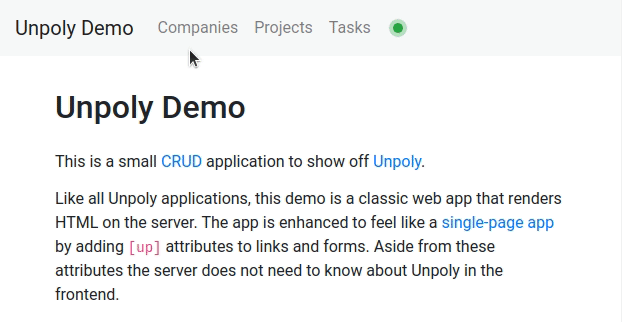

Loading indicators
==================

This page describes how to show loading indicators while waiting for the network.


Progress bar
------------

By default [late responses](/up:network:late) event will cause an animated
progress bar to appear at the top edge of the screen:



The progress bar can be disabled with `up.network.config.progressBar`.


### Styling the progress bar

The progress bar is implemented as a single `<up-progress-bar>` element.
Unpoly will automatically insert and remove this element as requests
are [late](/up:network:late) or [recovered](up:network:recover).

Its default appearance is a simple blue bar at the top edge of the screen,
mimicking the style of Chrome's native progress bar.

You may customize the style using CSS:

```css
up-progress-bar {
  background-color: red;
}
```


### Controlling when the progress bar appears

Unpoly will show the progress bar when a request is taking longer to respond
than `up.network.config.badResponseTime`.

You may override this per-request by using the [`{ badResponseTime }`](/up.render#options.badResponseTime)
option or [`[up-bad-response-time]`](/a-up-follow#up-bad-response-time) attribute.

Requests that are loading in the background should never show the progress bar. 
You may move a request into the background by passing
an [`{ background: true }`](/up.render#options.background) option
or setting an [`[up-background]`](/a-up-follow#up-background) attribute.

Requests from [preloading](/a-up-preload) or [polling](/up-poll) are automatically
marked as background requests.


Custom loading indicators
-------------------------

If you don't like the default progress bar, you can observe the `up:network:late`
and [`up:network:recover`](/up:network:recover) events to implement a custom
loading indicator that appears during long-running requests.

To implement a fully custom loading indicator instead,
observe the `up:network:late` and `up:network:recover` events.


To build a custom loading indicator, please an element like this in your application layout:

```html
<loading-indicator>Please wait!</loading-indicator>
```

Now add a [compiler](/up.compiler) that hides the `<loading-indicator>` element
while there are no long-running requests:

```js
// Disable the default progress bar
up.network.config.progressBar = false

up.compiler('loading-indicator', function(indicator) {
  function show() { up.element.show(indicator) }
  function hide() { up.element.hide(indicator) }

  hide()

  return [
    up.on('up:network:late', show),
    up.on('up:network:recover', hide)
  ]
})
```


Styling loading elements
------------------------

Unpoly adds CSS classes to fragments while they are loading over the network.
You may style these classes to provide instant feedback to user interactions.

See [Navigation feedback](/up.feedback) for details.


Signaling severe network problems
----------------------------------

See [Handling network issues](/network-issues).


@page loading-indicators
